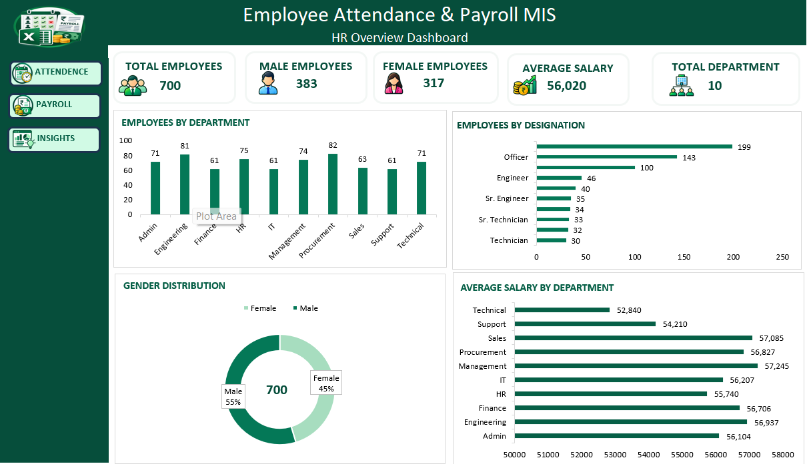
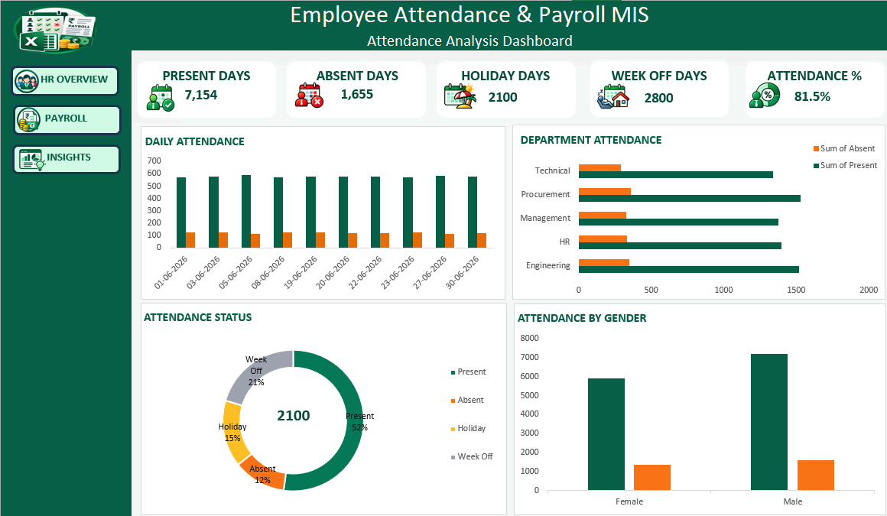
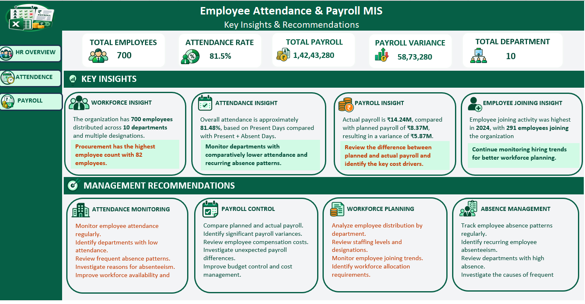

# 👥 Employee Attendance & Payroll MIS — Excel Dashboard

## 📊 Project Overview

The **Employee Attendance & Payroll MIS Dashboard** is an Excel-based MIS reporting project developed using **Microsoft Excel** to organize employee information, review attendance patterns, analyze payroll, and present HR metrics through structured dashboards.

The workbook brings employee master data, attendance records, and payroll data together for reporting and analysis. It uses Excel formulas, PivotTables, PivotCharts, KPI summaries, and dashboard visualizations to turn structured records into useful HR and payroll information.

The workbook includes four dashboard views: **HR Overview, Attendance Dashboard, Payroll Dashboard, and Insights Dashboard**.

---

## 🎯 Project Objectives

- Organize employee master records for HR reporting.
- Review employee attendance, presence, absence, weekly offs, and holidays.
- Compare attendance patterns across departments and reporting periods.
- Analyze payroll totals and monthly payroll trends.
- Compare planned and actual payroll where the source data supports it.
- Review payroll cost components and payroll variances.
- Present key HR and payroll indicators in clear dashboards.
- Support consistent, data-driven MIS reporting.

---

## 🛠️ Tools & Technologies

| Tool / Feature | Purpose |
|---|---|
| **Microsoft Excel** | Workbook development and reporting |
| **Excel Formulas** | Calculations and KPI generation |
| **PivotTables** | Summarizing employee, attendance, and payroll records |
| **PivotCharts** | Visual analysis and reporting |
| **Charts & Visualizations** | Showing trends and comparisons |
| **Conditional Formatting** | Highlighting relevant values |
| **Data Preparation** | Organizing records for analysis |
| **MIS Reporting** | Presenting information for management review |

### Excel Skills Used

- SUM, AVERAGE, COUNT, COUNTA
- COUNTIF and COUNTIFS
- SUMIF and SUMIFS
- AVERAGEIF and AVERAGEIFS
- IF, IFS, and IFERROR
- Lookup functions where used
- Date and text functions where used
- PivotTables and PivotCharts
- Filters, sorting, and conditional formatting
- KPI reporting and dashboard design

*Keep this list aligned with the functions and features actually used in your workbook.*

---

## 📁 Project Structure

```text
Employee-Attendance-Payroll-MIS-Excel/
│
├── Excel/
│   └── Employee_Attendance_Payroll_MIS.xlsx
│
├── images/
│   ├── HR_Overview.png
│   ├── Attendance_Dashboard.png
│   ├── Payroll_Dashboard .png
│   └── Insights_Dashboard.png
│
├── README.md
└── .gitattributes
```

---

## 📌 Dashboard Features

### 🔹 HR Overview Dashboard

Provides a consolidated view of workforce composition and employee-related indicators.

- Employee headcount and workforce overview
- Employees by department
- Employees by designation
- Gender distribution
- Average salary by department
- Summary charts for HR reporting

### 🔹 Attendance Dashboard

Helps review attendance patterns and employee availability.

- Daily attendance patterns
- Present, absent, late, and leave status where available
- Department-wise attendance comparison
- Attendance status distribution
- Attendance by gender
- Attendance trends across reporting periods

### 🔹 Payroll Dashboard

Presents payroll trends and payroll cost information.

- Monthly payroll trend
- Department-wise payroll
- Planned versus actual payroll, where available
- Payroll cost breakdown
- Salary and payroll summaries
- Payroll-related variance review

### 🔹 Insights Dashboard

Presents key insights and management recommendations based on employee, attendance, and payroll data.

- Total employees and total departments
- Overall attendance rate
- Total payroll and payroll variance
- Workforce distribution insights
- Attendance insights and monitoring recommendations
- Payroll insights and cost-control recommendations
- Employee joining trends
- Workforce planning recommendations
- Absence management recommendations

---

## 📈 Analysis Performed

### 1. Workforce Analysis

Reviewed workforce composition by department, designation, and gender to support employee reporting.

### 2. Attendance Analysis

Reviewed attendance status, department comparisons, and time-based patterns to help identify attendance trends.

### 3. Payroll Analysis

Reviewed payroll amounts, monthly trends, department-wise distribution, and payroll cost components.

### 4. Comparative Reporting

Used dashboard visuals to compare categories and highlight areas that may need further review.

---

## 📊 Key KPIs and Reporting Areas

| Dashboard | KPI / Reporting Area | Purpose |
|---|---|---|
| HR Overview | Employee headcount | Reviews workforce size |
| HR Overview | Employees by department | Compares workforce distribution |
| HR Overview | Gender distribution | Reviews workforce composition |
| HR Overview | Average salary by department | Compares average salary across departments |
| Attendance | Present and absent days | Reviews recorded attendance status |
| Attendance | Weekly offs and holidays | Reviews non-working-day categories |
| Attendance | Department attendance | Compares attendance across departments |
| Payroll | Total payroll | Reviews payroll totals for the selected period |
| Payroll | Monthly payroll trend | Tracks payroll changes over time |
| Payroll | Planned vs. actual payroll | Compares planned and recorded values, if available |
| Payroll | Payroll cost breakdown | Reviews payroll cost components |
| Insights | Attendance rate | Summarizes overall attendance performance |
| Insights | Payroll variance | Highlights the difference between planned and actual payroll |
| Insights | Employee joining trends | Supports workforce planning |
| Insights | Management recommendations | Highlights areas for further review |

*Actual KPI values depend on the workbook data, formulas, and filters. Refer to the workbook for calculated results.*

---

## 🖼️ Dashboard Preview

### 1. HR Overview Dashboard

The HR Overview dashboard provides a consolidated view of workforce composition and employee-related indicators.



### 2. Attendance Dashboard

The Attendance dashboard helps review attendance patterns, department attendance, attendance status, and gender-based attendance summaries.



### 3. Payroll Dashboard

The Payroll dashboard presents payroll trends, department-wise payroll, planned versus actual payroll where available, and payroll cost composition.


### 4. Insights Dashboard

The Insights Dashboard presents key performance indicators, workforce insights, attendance observations, payroll insights, employee joining trends, and management recommendations.

It includes recommendations covering attendance monitoring, payroll control, workforce planning, and absence management.



> **Image note:** Upload all four dashboard images into the repository's `images` folder with the exact filenames shown above. GitHub image paths are case-sensitive.

---

## 🔄 Data Analysis Process

```text
Employee Master Data
        ↓
Attendance Data + Payroll Data
        ↓
Data Preparation and Organization
        ↓
Excel Formulas and Calculations
        ↓
PivotTable Analysis
        ↓
KPI Reporting
        ↓
Dashboard Development
        ↓
HR and Payroll MIS Reporting
        ↓
Business Review and Insights
```

---

## 💡 Key Business Questions

1. How is the workforce distributed across departments?
2. Which designations have the highest employee counts?
3. What is the gender distribution of employees?
4. How does average salary vary by department?
5. How do attendance levels vary over time?
6. Which departments record higher or lower attendance?
7. What proportion of attendance records fall into each status category?
8. How does attendance compare by gender?
9. How does payroll change month by month?
10. How does payroll vary across departments?
11. How do planned payroll and actual payroll compare, if those fields are available?
12. Which payroll cost components contribute most to total payroll?

---

## 🔍 Business Value

This project demonstrates how Excel-based MIS reporting can help organize HR information, review attendance, analyze payroll records, and communicate key metrics through dashboards. The consolidated views can help HR teams and managers review trends and identify areas for further investigation.

---

## 📂 How to Use the Project

### Step 1 — Clone the Repository

Run the following command in your terminal:

```bash
git clone https://github.com/snavnit315-gif/Employee-Attendance-Payroll-MIS-Excel.git
```

Alternatively, download the repository using **Code → Download ZIP** on GitHub.

### Step 2 — Open the Excel Workbook

Open the `Excel` folder and launch `Employee_Attendance_Payroll_MIS.xlsx` in Microsoft Excel.

### Step 3 — Explore the Dashboards

Review the HR Overview, Attendance, Payroll, and Insights dashboards. Use available filters and slicers to explore the data, where supported by the workbook.

---

## 🎓 Skills Demonstrated

- Microsoft Excel
- MIS Reporting
- HR and Payroll Analysis
- Data Preparation and Organization
- Excel Formulas
- PivotTables and PivotCharts
- KPI Reporting
- Data Visualization
- Dashboard Development
- Business Reporting

---

## 🚀 Future Improvements

- Add automated data refresh where feasible.
- Expand interactive filtering with Excel slicers.
- Add more time-based attendance and payroll comparisons.
- Add exception reporting for unusual attendance or payroll values.
- Integrate the reporting model with Power BI.
- Extend KPI tracking based on business requirements.

---

## 👨‍💻 Author

**Navneet Singh**

B.Sc. Computer Science Graduate

**Skills:** Microsoft Excel | MIS Reporting | HR Analytics | Payroll Reporting | Dashboard Development | Data Analysis

---

## 📌 Disclaimer

This project is intended for educational and portfolio demonstration purposes. Remove or anonymize confidential employee details, personal information, and payroll data before publishing the workbook publicly.

---

## ⭐ If You Like This Project

If you find this project useful, feel free to:

- ⭐ Star the repository.
- 🍴 Fork the repository.
- 💡 Share your feedback.
- 🤝 Connect with me on LinkedIn.
